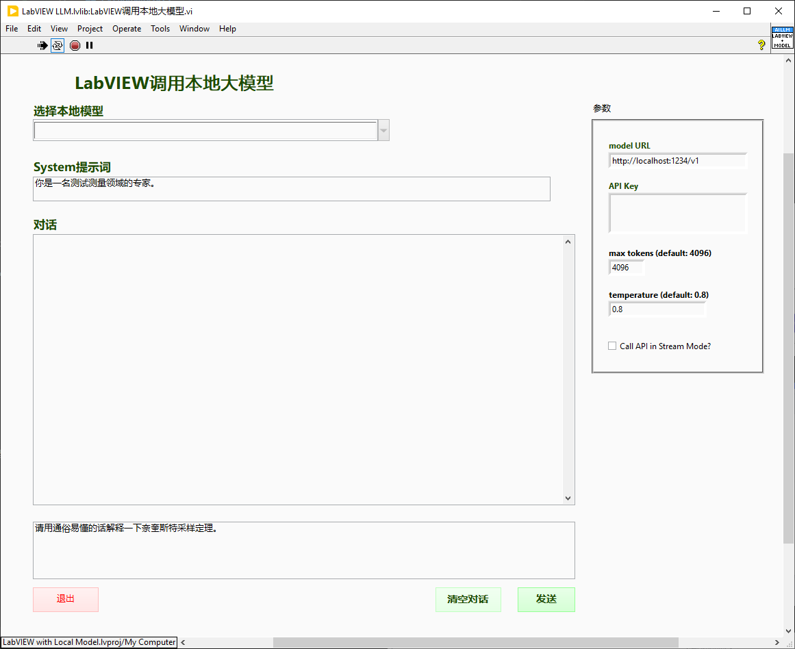

# 介绍
本代码库主要展示多个AI相关（尤其是大语言模型）的Demo
- LabVIEW调用本地大模型
- LabVIEW搭建本地知识库

# 准备工作

## LabVIEW环境设置
- 安装LabVIEW 2023或以上版本
- 通过VI Package Manager(VIPM)安装JKI JSON工具包

## Python环境设置
- 安装Python 3.10
  https://www.python.org/downloads/release/python-31011/

- 设置Python虚拟环境（Windows）

    ```cmd
    mkdir c:\dev\
    cd c:\dev\
    python -m venv labview-ai
    .\labview-ai\Scripts\activate
    ```

- 安装需要的Python库

    ```cmd
    cd <本代码库所在文件夹>
    pip install -r requirements.txt
    ```

# Demo

## 下载开源大模型

- 下载并安装LM Studio
  https://lmstudio.ai/

  

- 在LM Studio中搜索并下载开源大模型

  

- 打开如下设置来启用本地访问

  

## LabVIEW调用本地开源大模型

- 打开"src\LabVIEW with Local Model.lvproj"

  

- 打开"LabVIEW调用本地大模型.vi"

  

## LabVIEW搭建本地知识库

- 打开"src\LabVIEW RAG.lvproj"

  

- 打开"LabVIEW结合知识库调用本地大模型.vi"

  